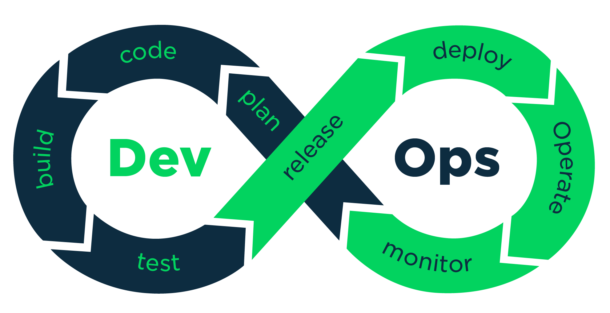

# ProjetDevopsIntegration



|||
|:-:|:-|
|Runtime|[](https://www.oracle.com/java/technologies/javase/jdk17-archive-downloads.html)
|Package|[](https://junit.org/junit5/) [](https://maven.apache.org/docs/3.6.3/release-notes.html) [](https://www.antlr.org/download.html)
|`main` branch status|[](https://github.com/LTBS46/ProjetDevopsIntegration/actions/workflows/actions.yml)
|`dev` branch status|[](https://github.com/LTBS46/ProjetDevopsIntegration/actions/workflows/actions.yml)

```xml
<dependency>
			<groupId>org.antlr</groupId>
			<artifactId>antlr4-runtime</artifactId>
			<version>4.13.2</version>
</dependency>
```